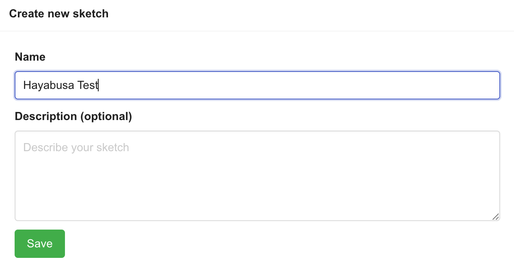
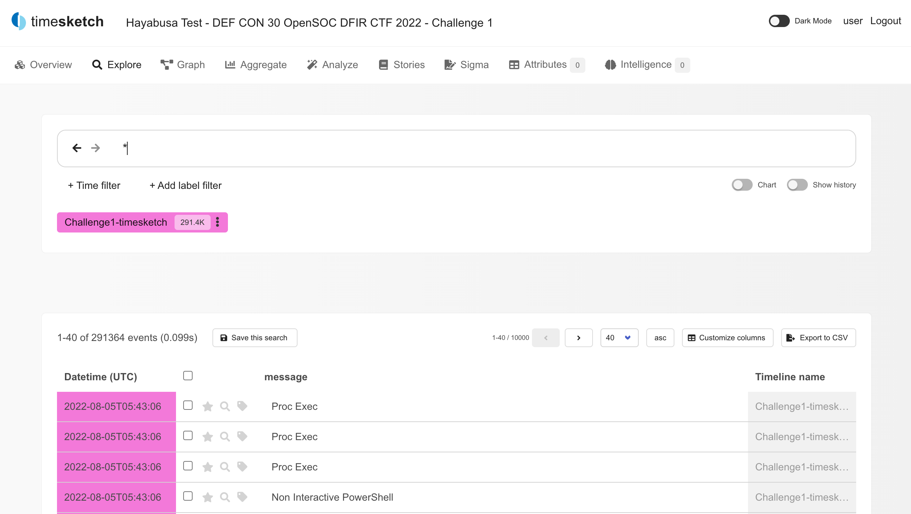
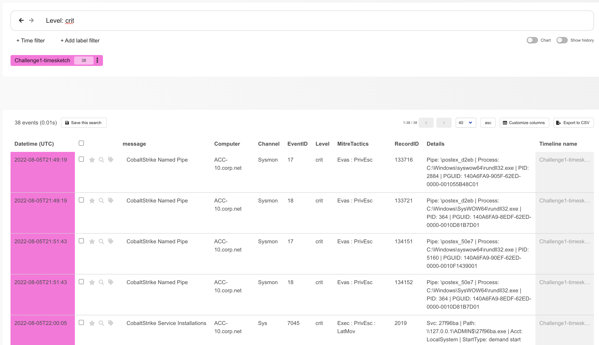
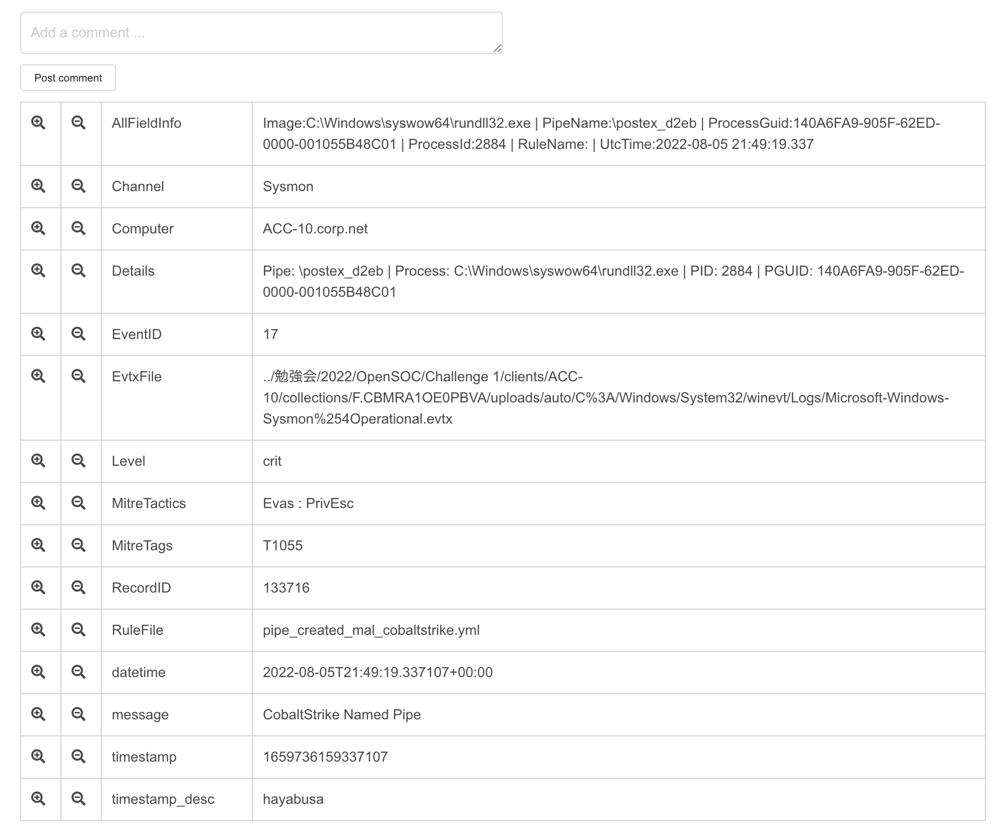
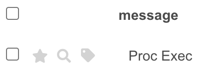

# Importing Hayabusa Results Into Timesketch

## About

"[Timesketch](https://timesketch.org/) is an open-source tool for collaborative forensic timeline analysis. Using sketches you and your collaborators can easily organize your timelines and analyze them all at the same time. Add meaning to your raw data with rich annotations, comments, tags and stars."


## Installing

We recommend using the Ubuntu 22.04 LTS Server edition.
You can download it [here](https://ubuntu.com/download/server).
Choose the minimal install when setting it up.
You won't have `ifconfig` available, so install it with `sudo apt install net-tools`.

After that, follow the install instructions [here](https://timesketch.org/guides/admin/install/):

``` bash
sudo apt install docker-compose
curl -s -O https://raw.githubusercontent.com/google/timesketch/master/contrib/deploy_timesketch.sh
chmod 755 deploy_timesketch.sh
cd /opt
sudo ~/deploy_timesketch.sh
cd timesketch
sudo docker-compose up -d
sudo docker-compose exec timesketch-web tsctl create-user <USERNAME>
```

## Prepared VM

We have pre-built a demo VM that you can use against the 2022 DEF CON 30 [OpenSOC](https://opensoc.io/) DFIR Challenge evidence hosted by [Recon InfoSec](https://www.reconinfosec.com/). (The evidence has already been imported.)
You can download it [here](https://www.dropbox.com/s/3be3s5c2r22ux2z/Prebuilt-Timesketch.ova?dl=0).
You can find the other evidence for this challenge [here](https://docs.google.com/document/d/1XM4Gfdojt8fCn_9B8JKk9bcUTXZc0_hzWRUH4mEr7dw/mobilebasic) and questions [here](https://docs.google.com/spreadsheets/d/1vKn8BgABuJsqH5WhhS9ebIGTBG4aoP-StINRi18abo4/htmlview).

The username for the VM is `user` and password is `password`.

## Logging in

Find out the IP address with `ifconfig` and open it with a web browser.
You will be redirected to a login page as shown below:


Log in with the docker-compose user credentials you used when adding a user.

## Create a new sketch

Click on `New investiation` and create a name for the new sketch:



## Upload timeline

Click `Upload timeline` and upload a CSV file that you created with the following command:

```shell
hayabusa-2.5.1-win-x64.exe csv-timeline -d ../hayabusa-sample-evtx --RFC-3339 -o timesketch-import.csv -p timesketch-verbose -U
```

You can add `-m low` if you just want alerts and not include Windows events.

## Analyzing results

You should get the following screen:



By default, only the UTC timestamp and alert rule title will be displayed so click `Customize columns` to add more fields.

> Warning: In the current version, there is a bug in that a new column will be blank. Please add another column (and then delete it afterwards if not needed) to display new columns.

You can also filter on fields in the searchbox, such as `Level: crit` to only show critical alerts.




If you click on an event, you can see all of the field information:



With the three icons to the left of the alert title, you can star events of interest, search +- 5 minutes to see the context of an event and add labels.


